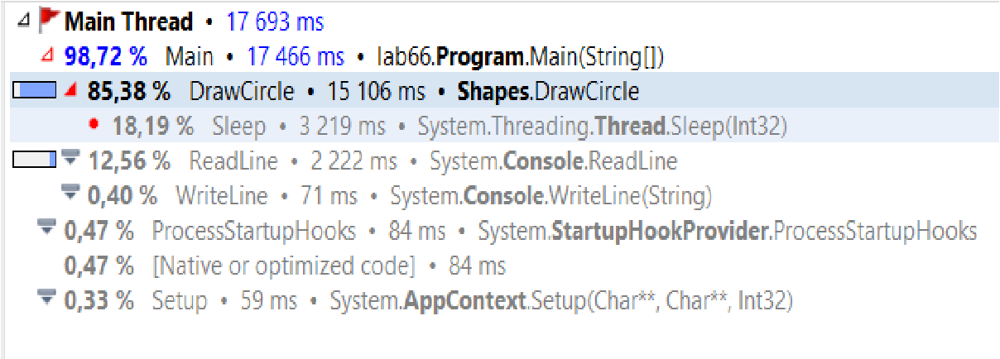
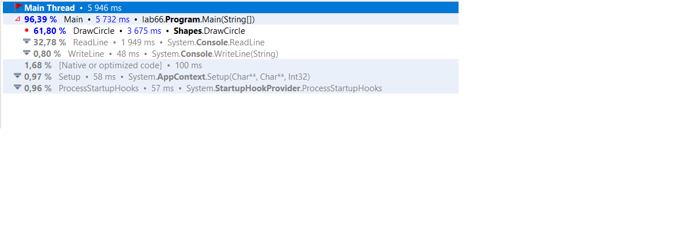

# laba5_os

Origianal code:
```c#
namespace lab66
{
    class Program
    {
        static void Main(string[] args)
        {
            Shapes shapes = new Shapes();
            Console.WriteLine("\n Inside main()\n");
            string typeOfShape = Console.ReadLine();
	
            int i = 0;

            for(;i<0xffffff;i++);
            switch(typeOfShape){
                case "square":
                    Shapes.DrawSquare();
                    break;
                case "circle":
                    shapes.DrawCircle();
                    break;
            }
        }
    }
}

class Shapes
{
    public void DrawCircle()
    {
        for(int i = 0; i < 1000000000; i++)
        {
            //process of drawing
            Thread.Sleep(100);
        }
    }

    public static void DrawSquare()
    {
        for(int i = 0; i < 1000000000; i++)
        {
            //process of drawing
            Thread.Sleep(100);
        }
    }
}
```
Results: 
As we can see most of execution time take DrawCircle function.
To compare this performance we can remove thread sleep 
```c#
namespace lab66
{
    class Program
    {
        static void Main(string[] args)
        {
            Shapes shapes = new Shapes();
            Console.WriteLine("\n Inside main()\n");
            string typeOfShape = Console.ReadLine();
	
            int i = 0;

            for(;i<0xffffff;i++);
            switch(typeOfShape){
                case "square":
                    Shapes.DrawSquare();
                    break;
                case "circle":
                    shapes.DrawCircle();
                    break;
            }
        }
    }
}

class Shapes
{
    public void DrawCircle()
    {
        for(int i = 0; i < 1000000000; i++)
        {
            //process of drawing
        }
    }

    public static void DrawSquare()
    {
        for(int i = 0; i < 1000000000; i++)
        {
            //process of drawing
        }
    }
}
```

After removing sleep we can see that 30% of program execution take ReadLine and 60% is DrawCircle

Results:

